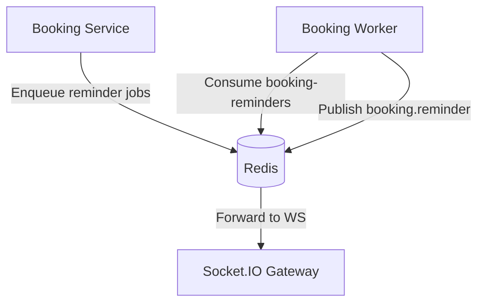

# Booking Worker

BullMQ worker that processes booking reminder jobs and publishes real-time updates via Redis pub/sub. Pairs with the Booking Service Socket.IO gateway to notify clients.

## Architecture

## Environment
- REDIS_URL (default: redis://localhost:6379)

## Install
pnpm install

## Run (dev)
- pnpm -C apps/booking-worker dev

## Build / Start (prod)
- pnpm -C apps/booking-worker build
- pnpm -C apps/booking-worker start

## Queues & Channels
- Queue: booking-reminders (delayed jobs scheduled by the service)
- Publishes: booking.reminder (Redis pub/sub)

Logs:
- On start: "booking-worker ready"
- On publish: "Sent booking.reminder { bookingId, startTime }"
